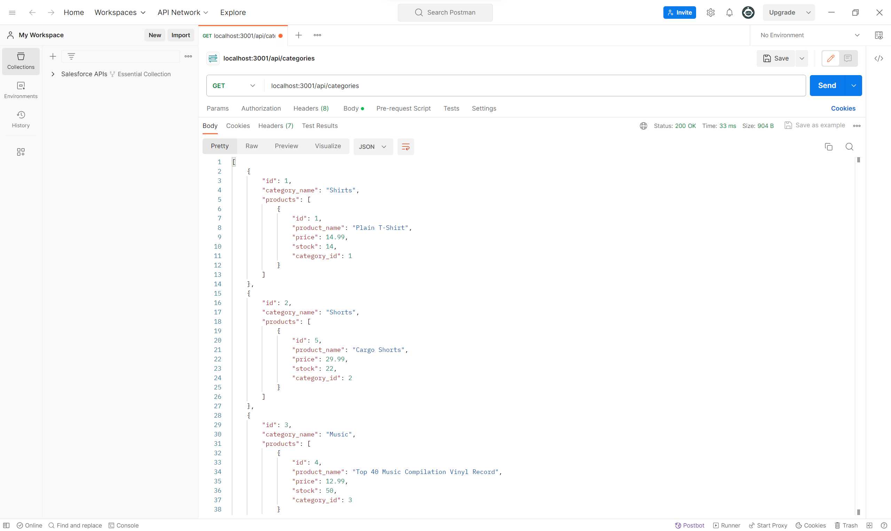

# Funky ORM App

## User Story

```md
AS A manager at an internet retail company
I WANT a back end for my e-commerce website that uses the latest technologies
SO THAT my company can compete with other e-commerce companies
```

## Acceptance Criteria

```md
GIVEN a functional Express.js API
WHEN I add my database name, MySQL username, and MySQL password to an environment variable file
THEN I am able to connect to a database using Sequelize
WHEN I enter schema and seed commands
THEN a development database is created and is seeded with test data
WHEN I enter the command to invoke the application
THEN my server is started and the Sequelize models are synced to the MySQL database
WHEN I open API GET routes in Insomnia for categories, products, or tags
THEN the data for each of these routes is displayed in a formatted JSON
WHEN I test API POST, PUT, and DELETE routes in Insomnia
THEN I am able to successfully create, update, and delete data in my database
```

## Objective

Using the starter code, complete the files inside of the 'models' folder, as well as the files inside of the 'routes' folder, and import the Sequelize package inside of 'server.js'. By first populating the ecommerce_db database created in the 'db' folder, using the seeds files inside of the 'seeds' folder, use index.js to create the data and have stored inside of ecommerce_db. Once this is done, run the database, and using a service such as Postman or Insomnia, execute GET, POST, PUT, or DELETE commands using localhost:3001 to work with the database's queries.



## Link to Video
https://www.youtube.com/watch?v=uBGy4H8eJ5Y


## How to Run

1. Run 'git clone (repo link)' on Git Bash'
2. CD into project directory
3. Run project via code editor (e.g. Visual Studio Code)
4. Open the terminal
5. CD into 'Develop' folder
6. Run 'npm install' to download all necessary dependencies
7. Run 'npm run seed' to populate ecommerce_db database with files inside of 'seeds' folder
8. Run 'npm start' to begin running the database
9. Using Postman or Insonmia, open live server (localhost:3001/api/(categories, products, or tags)) to begin performing GET, POST, PUT, or DELETE operations